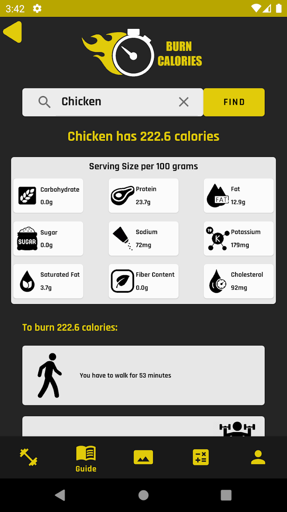
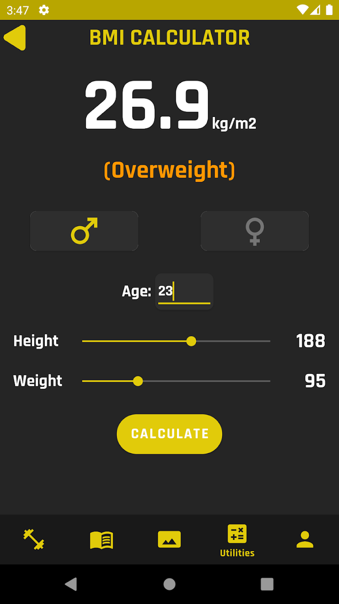

<h1>  
SocialFit
</h1>

 

### Screenshots

| Exercises Screen | Social Screen | Profile Screen |
|:-:|:-:|:-:|
|  |  |  

| Calories Screen | Calculator Screen |
|:-:|:-:|
 |  

## Tech Stack
* [ViewModel][17] - Easily schedule asynchronous tasks for optimal execution.
* [LiveData][31] - is an observable data holder class. Unlike a regular observable, LiveData is lifecycle-aware, meaning it respects the lifecycle of other app components, such as activities, fragments, or services.
* [View Binding][11] - a feature that allows you to more easily write code that interacts with views.
* [Data Binding][86] - The Data Binding Library is a support library that allows you to bind UI components in your layouts to data sources in your app using a declarative format rather than programmatically.
* [Lifecycle][22] - As a user navigates through, out of, and back to your app, the Activity instances in your app transition through different states in their lifecycle.
* [Navigation Component][24] - Handle everything needed for in-app navigation. asynchronous tasks for optimal execution.
* [Safe-Args][25] - For passing data between destinations.
* [Retrofit][90]- Retrofit is a REST client for Java/ Kotlin and Android by Square inc under Apache 2.0 license. Its a simple network library that is used for network transactions. By using this library we can seamlessly capture JSON response from web service/web API.
* [OkHttp][23] - Doing HTTP efficiently makes your stuff load faster and saves bandwidth.
* [Kotlin Flow][33] - In coroutines, a flow is a type that can emit multiple values sequentially, as opposed to suspend functions that return only a single value.
* [Coroutines][51] - A concurrency design pattern that you can use on Android to simplify code that executes asynchronously.
* [Dagger-Hilt][93] - A dependency injection library for Android that reduces the boilerplate of doing manual dependency injection in your project.
* [Glide][27] - for image loading framework for Android that wraps media decoding, memory and disk caching, and resource pooling into a simple and easy to use interface.

[11]: https://developer.android.com/topic/libraries/view-binding
[93]: https://developer.android.com/training/dependency-injection/hilt-android
[51]: https://developer.android.com/kotlin/coroutines
[90]: https://square.github.io/retrofit/
[33]: https://developer.android.com/kotlin/flow
[22]: https://developer.android.com/guide/components/activities/activity-lifecycle
[17]: https://developer.android.com/topic/libraries/architecture/viewmodel?gclid=Cj0KCQiA4uCcBhDdARIsAH5jyUlE1HL0TNxXu5b4pw6DEMOlRccWdVnqiRcLji7OHsDN6trNOKa-sdgaAr6rEALw_wcB&gclsrc=aw.ds
[23]: https://square.github.io/okhttp/
[24]: https://developer.android.com/guide/navigation/navigation-getting-started
[25]: https://developer.android.com/guide/navigation/navigation-pass-data
[31]: https://developer.android.com/topic/libraries/architecture/livedata
[27]: https://github.com/bumptech/glide
[86]: https://developer.android.com/topic/libraries/data-binding
