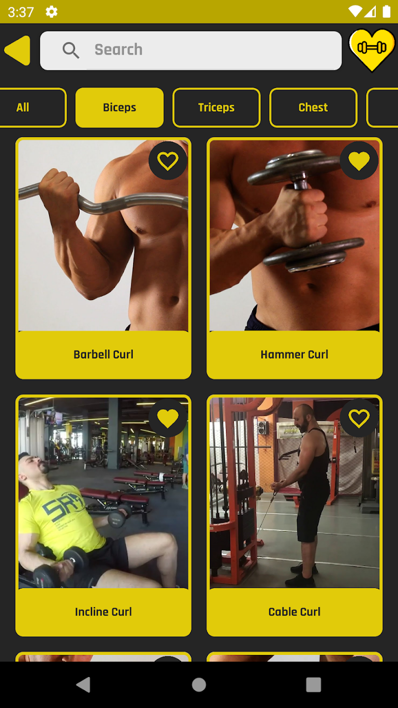
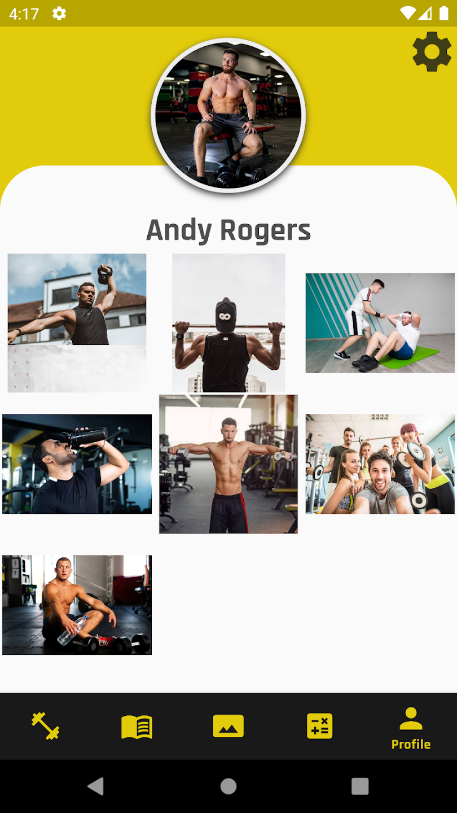

<h1>  
SocialFit
</h1>

 

### Screenshots

| Exercises Screen | Social Screen | Profile Screen |
|:-:|:-:|:-:|
|  |  |  

| Calories Screen | Calculator Screen |
|:-:|:-:|
 |  

## Tech Stack
* [ViewModel][1] - Easily schedule asynchronous tasks for optimal execution.
* [LiveData][2] - is an observable data holder class. Unlike a regular observable, LiveData is lifecycle-aware, meaning it respects the lifecycle of other app components, such as activities, fragments, or services.
* [View Binding][3] - a feature that allows you to more easily write code that interacts with views.
* [Data Binding][4] - The Data Binding Library is a support library that allows you to bind UI components in your layouts to data sources in your app using a declarative format rather than programmatically.
* [Lifecycle][5] - As a user navigates through, out of, and back to your app, the Activity instances in your app transition through different states in their lifecycle.
* [Navigation Component][6] - Handle everything needed for in-app navigation. asynchronous tasks for optimal execution.
* [Safe-Args][7] - For passing data between destinations.
* [Retrofit][8]- Retrofit is a REST client for Java/ Kotlin and Android by Square inc under Apache 2.0 license. Its a simple network library that is used for network transactions. By using this library we can seamlessly capture JSON response from web service/web API.
* [OkHttp][9] - Doing HTTP efficiently makes your stuff load faster and saves bandwidth.
* [Kotlin Flow][10] - In coroutines, a flow is a type that can emit multiple values sequentially, as opposed to suspend functions that return only a single value.
* [Coroutines][11] - A concurrency design pattern that you can use on Android to simplify code that executes asynchronously.
* [Dagger-Hilt][12] - A dependency injection library for Android that reduces the boilerplate of doing manual dependency injection in your project.
* [Room][13] - The Room persistence library provides an abstraction layer over SQLite to allow fluent database access while harnessing the full power of SQLite.
* [Glide][14] - for image loading framework for Android that wraps media decoding, memory and disk caching, and resource pooling into a simple and easy to use interface.
* [Firebase][15] - Firebase is an app development platform that helps you build and grow apps and games users love.

[1]: https://developer.android.com/topic/libraries/architecture/viewmodel?hl=en
[2]: https://developer.android.com/topic/libraries/architecture/livedata
[3]: https://developer.android.com/topic/libraries/view-binding
[4]: https://developer.android.com/topic/libraries/data-binding
[5]: https://developer.android.com/guide/components/activities/activity-lifecycle
[6]: https://developer.android.com/guide/navigation/navigation-getting-started
[7]: https://developer.android.com/guide/navigation/navigation-pass-data
[8]: https://square.github.io/retrofit/
[9]: https://square.github.io/okhttp/
[10]: https://developer.android.com/kotlin/flow
[11]: https://developer.android.com/kotlin/coroutines
[12]: https://developer.android.com/training/dependency-injection/hilt-android
[13]: https://developer.android.com/training/data-storage/room?hl=en
[14]: https://github.com/bumptech/glide
[15]: https://firebase.google.com/
